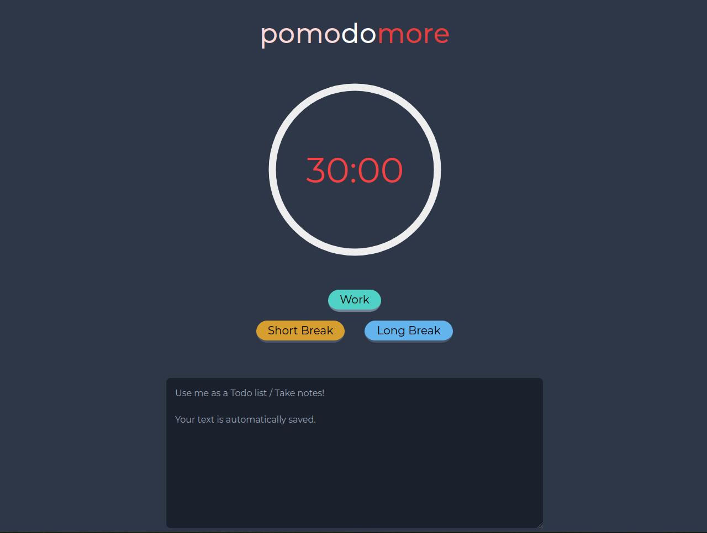

# pomodomore

A Pomodoro-technique timer in the browser, with a built-in notepad that auto-saves to local storage.

**Live demo:** https://jeonwonje.github.io/pomodomore/



## Features

- 30-minute work sessions with a circular progress timer
- Short (5 min) and long (15 min) break modes
- Pause, resume, and reset controls
- Notepad textarea that persists across reloads via `localStorage`

## Built with

- Vanilla JavaScript
- [Tailwind CSS](https://tailwindcss.com/) for styling
- [progressbar.js](https://kimmobrunfeldt.github.io/progressbar.js/) for the timer animation

## Run locally

No build step is required to use it — `style.css` is already committed.

```bash
git clone https://github.com/jeonwonje/pomodomore.git
cd pomodomore
open index.html   # or just double-click the file
```

If you edit `src/style.css`, rebuild Tailwind:

```bash
npm install
npm run build
```

## License

MIT &copy; Jeon Wonje
